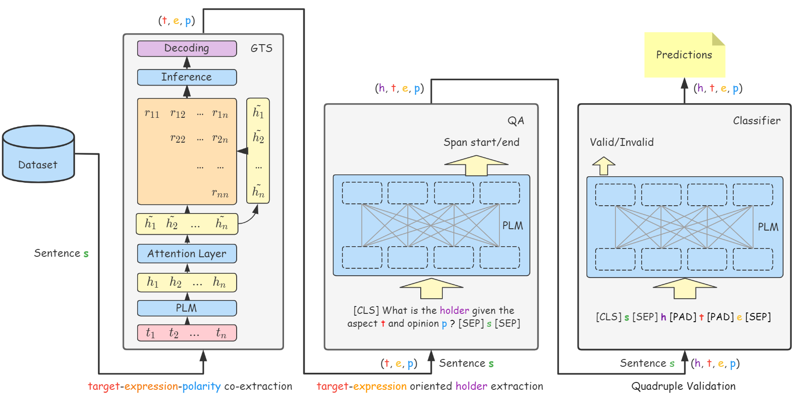

# SemEval2022-Task10

This repo contains our participating system for [Task 10](https://github.com/jerbarnes/semeval22_structured_sentiment/): "Structured Sentiment Analysis" in [SemEval 2022](https://semeval.github.io/SemEval2022/). The system ranked 10/32 in the monolingual track.

## Results

### Monolingual

|                |  SF1  |  SP   |  SR   |
| :------------: | :---: | :---: | :---: |
|   opener_en    | 0.710 | 0.788 | 0.646 |
|   opener_es    | 0.669 | 0.735 | 0.614 |
|     norec      | 0.487 | 0.539 | 0.444 |
|      mpqa      | 0.269 | 0.369 | 0.211 |
|    ds_unis     | 0.416 | 0.480 | 0.366 |
| multibooked_ca | 0.658 | 0.720 | 0.605 |
| multibooked_eu | 0.651 | 0.705 | 0.605 |

### Cross-lingual

|                |  SF1  |  SP   |  SR   |
| :------------: | :---: | :---: | :---: |
|   opener_es    | 0.620 | 0.716 | 0.548 |
| multibooked_ca | 0.605 | 0.596 | 0.615 |
| multibooked_eu | 0.569 | 0.573 | 0.566 |

## System Overview



## Setup

### Docker

Build runtime docker image with ```./Dockfile```: 

```bash
docker build --rm -f "./Dockerfile" -t transformers:SemEval2022-Task10 "."
```

### Pip

Create runtime environment with ```./requirements.txt```:

```bash
conda create -n SemEval2022-Task10 python=3.8
conda activate SemEval2022-Task10
pip install -r requirements.txt
```

### Model preparation

Prepare all the backbones this repo depends on through executing the following script:

```
bash ./pretrained_models/prepare_all_backbones.sh
```

### Reproduce

Note that some hyperparameters are tuned based on GPUs with **80G** CUDA memory. GPUs with less memory are likely to encounter OOM problems when training some subsystems, especially the co-extraction one.

Considering the high GPU memory limits and very long GPU hours for training, we made all the predictions public at ```./src/GTS/predictions/``` . You can directly use them for scoring and comparing without training the models.

### Co-extraction

Train the GTS-based Co-extraction subsystem:

```bash
# Monolingual training
bash ./scripts/train_GTS_*.sh $gpu_num # train individual models
bash ./scripts/ensemble_GTS.sh $gpu_num # get ensemble model
# Cross-lingual training
bash ./scripts/train_GTS_xlm-roberta-large-crosslingual_v1.sh $gpu_num # train crosslingual model
```

The trained models and evaluation outputs will be saved at ```./src/GTS/saved_models/extract/```

Predict:

```bash
bash ./scripts/predict_GTS.sh $gpu_num # Co-extraction subsystem predict
```

### Holder Extraction

Train the holder extraction subsystem:

```bash
bash ./scripts/convert_step1_predictions_to_qa_format.sh
bash ./scripts/train_QA_*.sh $gpu_num
```

The trained models and evaluation outputs will be saved at ```./src/GTS/saved_models/QA/```

Predict:

```shell
bash ./scripts/predict_QA.sh $gpu_num
```

### Quadruple Validation

Train the quadruple validation subsystem:

```bash
# Monolingual training
bash ./scripts/train_classifier_*.sh $gpu_num
# Cross-lingual training
bash ./scripts/train_classifier_labse-crosslingual.sh $gpu_num
```

The trained models and evaluation outputs will be saved at ```./src/GTS/saved_models/classify/```

Predict:

```bash
# Monolingual predicting
bash ./scripts/predict_end2end.sh
# Cross-lingual predicting
bash ./scripts/predict_end2end_crosslingual.sh
```

## API

We also provide an servable API for quadruple extraction using the extraction part of our method. You can try it with:

```bash
pip install fastapi==0.75.0
bash ./scripts/start_api.sh
```
The API will serve at port 3000. Visiting ```https://localhost:3000/docs/``` for more info.

## Citation

```
```

## Acknowledgements

Thanks the great help from [@Roger](https://github.com/luyaojie), the awesome [idea](https://aclanthology.org/2020.findings-emnlp.234/) and [implementation](https://github.com/NJUNLP/GTS) of GTS. We are still working on improving the reproductivity. Welcome to open an issue or submit a Pull Request to report/fix the bugs.